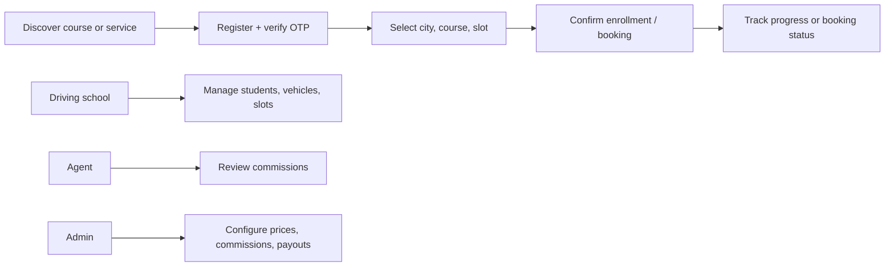

# Driveflow

> A multi-role driving education platform for courses, schools, mock tests, service bookings, commissions, and operational payouts.

## Overview

Driveflow brings learner enrollment, driving-school operations, vendor services, mock testing, and administrator controls into one role-aware product. It supports course and city pricing, time-slot availability, student progress, school documents and vehicles, vendor service bookings, agent commissions, payout invoices, and live admin notifications.

## My contribution

- React 19 frontend with learner, driving-school, vendor, agent, and admin workspaces
- Laravel 12 API with Sanctum authentication, role-aware route groups, and throttled OTP verification
- Course catalog, city-specific pricing, enrollment preferences, invoices, feedback, and progress tracking
- Mock-test authoring, question media, result reporting, and learner test flows
- Vendor service bookings with schedules, commission rules, booking status, and payout calculations
- Agent commission configuration, payout records, downloadable invoices, and reconciliation views
- Realtime dashboard updates through Laravel Reverb/Pusher and responsive Bootstrap interfaces

## Skills demonstrated

| Area | Applied |
| --- | --- |
| Full-stack delivery | React application shell paired with Laravel API and route-level domain modules |
| Education workflows | Courses, city pricing, enrollments, schedules, progress, tests, feedback, and invoices |
| Marketplace operations | Vendors, services, booking status, commission rules, and payout calculations |
| Security | Sanctum tokens, OTP verification, throttling, admin-only routes, and scoped role access |
| Realtime UX | Live dashboard snapshots, notifications, and event-driven UI updates |
| Reporting | PDF invoices, commission summaries, payout history, and operational exports |

## Representative flow

## Technical stack

React 19 · Laravel 12 · PHP 8.2 · Sanctum · Reverb/Pusher · Bootstrap · Redux Toolkit · Axios · Dompdf · MySQL-compatible persistence.

See [architecture](docs/ARCHITECTURE.md), [user flows](docs/USER-FLOWS.md), [security policy](SECURITY.md), [screenshot guide](docs/SCREENSHOT-GUIDE.md), and [GitHub setup](docs/GITHUB-SETUP.md).
"# driveflow" 
