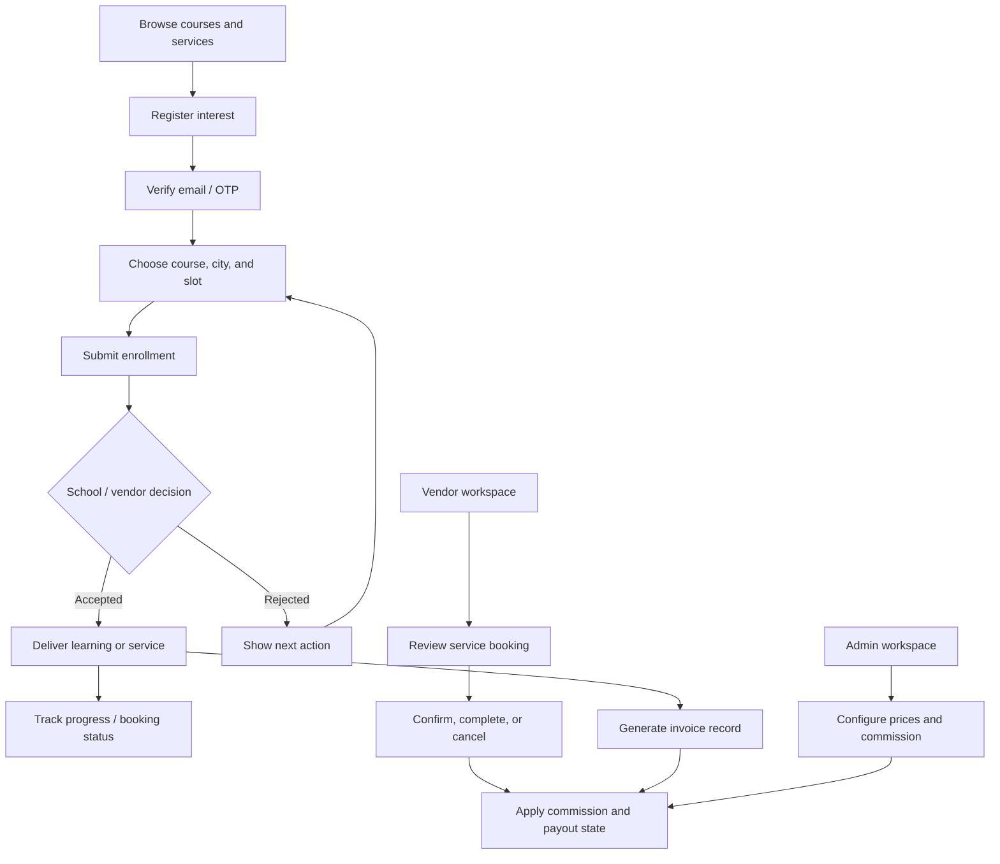

# User flows

## Commission and payout lifecycle

1. The platform resolves a course/service price for the selected city or vendor offering.
2. A commission rule is applied as a percentage or fixed amount.
3. The booking or enrollment retains the commercial metadata for admin review.
4. Eligible agent/vendor balances are summarized into payout records and invoices.
5. Admin actions mark payouts as paid while preserving an auditable history.
